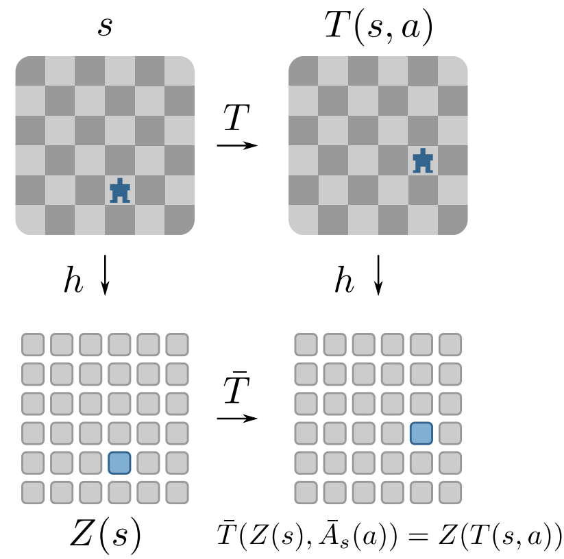

# Plannable Approximations to MDP Homomorphisms: Equivariance under Actions

Code accompanying the paper:

**Plannable Approximations to MDP Homomorphisms: Equivariance under Actions**  
Elise van der Pol, Thomas Kipf, Frans A. Oliehoek, Max Welling.  
http://www.ifaamas.org/Proceedings/aamas2020/pdfs/p1431.pdf  



**Abstract:** 
This work exploits action equivariance for representation learning
in reinforcement learning. Equivariance under actions states that
transitions in the input space are mirrored by equivalent transitions
in latent space, while the map and transition functions should also
commute. We introduce a contrastive loss function that enforces
action equivariance on the learned representations. We prove that
when our loss is zero, we have a homomorphism of a deterministic
Markov Decision Process (MDP). Learning equivariant maps leads
to structured latent spaces, allowing us to build a model on which
we plan through value iteration. We show experimentally that for
deterministic MDPs, the optimal policy in the abstract MDP can be
successfully lifted to the original MDP. Moreover, the approach easily
adapts to changes in the goal states. Empirically, we show that in
such MDPs, we obtain better representations in fewer epochs compared
to representation learning approaches using reconstructions,
while generalizing better to new goals than model-free approaches.

## Installation
* conda env create -f prae.yml
* source activate prae
* pip install -e .

## Usage
* cd notebooks
* jupyter notebook

### Cite
If you use this code in your own work, please cite our paper:
```
@inproceedings{van2020plannable,
  title={Plannable Approximations to {MDP} Homomorphisms: Equivariance under Actions},
  author={van der Pol, Elise and Kipf, Thomas and Oliehoek, Frans A. and Welling, Max},
  booktitle={International Conference on Autonomous Agents and MultiAgent Systems},
  year={2020}
}

```

The Robert Bosch GmbH is acknowledged for financial support.
